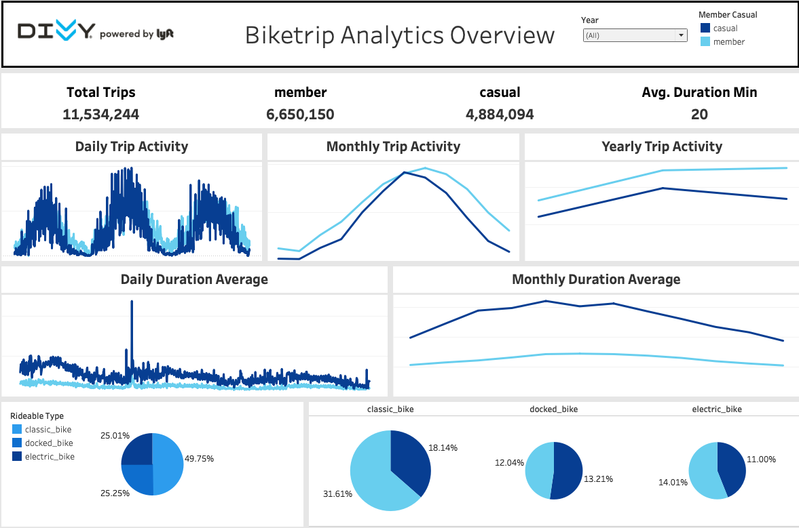

# Divvy Biketrip Analysis 

## Overview
In this repository, we will analyze Divvy's bike share data in the Chicago metropolitan area to understand the relationship between different kinds of members: Casual users (who don't have an annual subscription) and Members (who have an annual subscription). Additionally, we will develop an ETL pipeline to prepare our dataset for analysis. Our final product will consist of an interactive Tableau dashboard that allows users to explore and visualize our findings. For those who want to follow along, we will provide a tutorial soon.

Note that all analysis and computations will be done locally. However, if you prefer to utilize cloud storage, we've also done the same analysis using cloud storage [here](https://github.com/ETM1123/divvy-data-pipeline).

## Datasets
The datasets used in this project are as follows: 
  - Divvy Historic Bike tripdata: The main dataset, available in CSV format [here](https://divvy-tripdata.s3.amazonaws.com/index.html) 
  - Chicago neighborhood data: A GeoJSON file that helps us identify the neighborhood of each trip. The file is available [here](https://data.cityofchicago.org/Facilities-Geographic-Boundaries/Boundaries-Neighborhoods/bbvz-uum9)
  - US states data: A shapefile that helps us verify each trip's geolocation information. The file is available [here](https://www.census.gov/geographies/mapping-files/time-series/geo/carto-boundary-file.html)

## Final product
Here is a screenshot of the overview dashboard:

We will also be adding more dashboards soon. Feel free to play around with the dashboard and explore our findings. Access the dashboard
[here](https://public.tableau.com/app/profile/eyob.tadele.manhardt/viz/GoogleCapstoneProjectDivvyBiketripOverviewDashboard/DivvyBiketripAnalyticsOverview#1)
